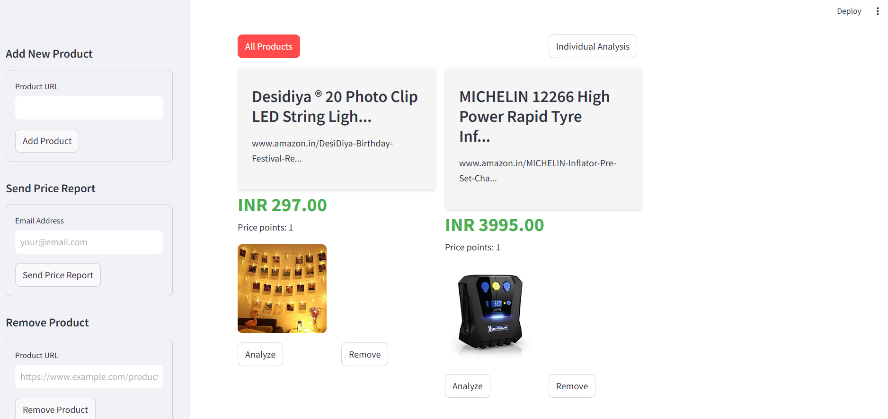
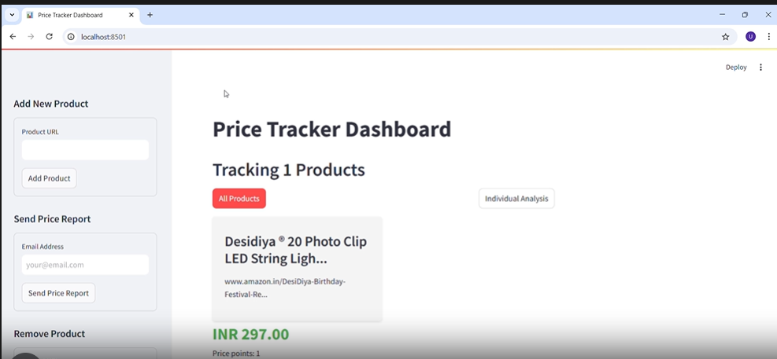
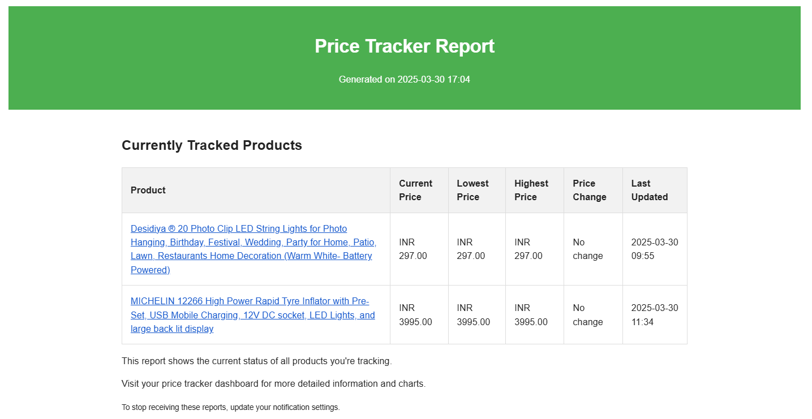

# Dynamic Price Tracker

An automated system that tracks e-commerce product prices, detects price drops, and sends comprehensive price reports.



## Features

- Automated product page scraping from multiple e-commerce sites
- Robust price history tracking and storage
- Price trend analysis with configurable thresholds
- Comprehensive price reports via email
- Streamlit dashboard for price trend visualization and report generation
- Scheduling for automated monitoring and reporting
- Support for Amazon and other e-commerce sites

## Demo

### Video Demonstration

Check out how the Dynamic Price Tracker works in action:

[](https://github.com/ujjwalr27/Ecommerce-Price-Tracker/blob/main/demo.mp4)
*Click on the image above to view the demo video*

You can also download or view the demo directly:
- [View or download demo video](https://github.com/ujjwalr27/Ecommerce-Price-Tracker/raw/main/demo.mp4)

### Screenshots

#### Dashboard Overview


#### Email Report


## Setup

1. Clone the repository:
   ```
   git clone https://github.com/ujjwalr27/dynamic-price-analysis.git
   cd dynamic-price-analysis
   ```

2. Run the setup script which will:
   - Create a virtual environment
   - Install dependencies
   - Set up configuration
   ```
   python setup.py
   ```

   Alternatively, you can manually set up:
   ```
   python -m venv venv
   
   # On Windows:
   venv\Scripts\activate
   
   # On macOS/Linux:
   source venv/bin/activate
   
   pip install -r requirements.txt
   ```

3. Configure Gmail account for sending price reports:
   - Enable 2FA on your Gmail account at https://myaccount.google.com/security
   - Generate an App Password: Go to your Google Account → Security → App passwords
   - Add your Gmail address and the generated App Password to your `.env` file

4. (Optional) Set up Discord notifications:
   - Create a webhook URL in your Discord server: Server Settings → Integrations → Webhooks
   - Add the webhook URL to your `.env` file as `DISCORD_WEBHOOK_URL`

## Usage

### Adding Products to Track

Use the `add_product.py` script to manage products:

```
# Add a product
python add_product.py add "https://www.amazon.com/dp/B08NFGH7TL"

# List all tracked products
python add_product.py list

# Remove a product
python add_product.py remove "https://www.amazon.com/dp/B08NFGH7TL"
```

### Running Price Checks Manually

To check prices for all tracked products:

```
python app/tasks/check_prices.py --check-all
```

To check a specific product:

```
python app/tasks/check_prices.py --url "https://www.amazon.com/dp/B08NFGH7TL"
```

### Sending Price Reports

You can send price reports via email using the following options:

1. **From the Command Line:**
   ```
   # Send a report to a specific email address
   python app/tasks/check_prices.py --check-all --email "your@email.com"
   ```

2. **From the Dashboard:**
   - Navigate to the "Send Price Report" section in the sidebar
   - Enter your email address
   - Click "Send Price Report"

3. **Scheduled Reports:**
   ```
   # Schedule price checks every 12 hours and send a daily report
   python app/tasks/scheduler.py --interval 12 --email "your@email.com" --daily-report
   ```

### Setting Up Scheduling

#### Windows Task Scheduler

1. Run the PowerShell script to set up a scheduled task:
   ```
   powershell -ExecutionPolicy Bypass -File setup_task.ps1 -IntervalHours 3
   ```

   This will create a task that runs every 3 hours (adjust as needed).

2. Or you can manually create a scheduled task using the provided batch file:
   - Open Task Scheduler
   - Create a new Task
   - Add a trigger (e.g., daily at specific times)
   - Add an action to run `run_tracker.bat`
   - Set other options as needed

#### Using Python's APScheduler

Run the scheduler script to continuously check prices and optionally send reports:

```
# Basic scheduling (check prices at specified interval)
python app/tasks/scheduler.py

# Check prices every 6 hours and send a daily report at 8 AM
python app/tasks/scheduler.py --interval 6 --email "your@email.com" --daily-report
```

The base check interval is controlled by the `SCRAPE_INTERVAL_HOURS` setting in your `.env` file.

#### Linux/macOS cron

Add a cron job to run the script periodically:

```
# Edit crontab
crontab -e

# Check prices every hour
0 * * * * cd /path/to/dynamic-price-analysis && /path/to/venv/bin/python app/tasks/check_prices.py --check-all >> /path/to/log/price_checker.log 2>&1

# Send daily price report at 8 AM
0 8 * * * cd /path/to/dynamic-price-analysis && /path/to/venv/bin/python app/tasks/check_prices.py --check-all --email "your@email.com" >> /path/to/log/price_report.log 2>&1
```

### Running the Dashboard

The Streamlit dashboard allows you to visualize price trends and manage tracked products:

```
streamlit run app/dashboard.py
```

This will start a local web server, typically at http://localhost:8501

Features:
- View all tracked products
- Add new products directly from the UI
- See detailed price history with charts
- Send price reports via email
- Download price history data as CSV

## Deployment

### Deploying to Railway

The application can be easily deployed on Railway:

1. Fork/Clone this repository to your GitHub account
2. Create a new Railway project
3. Connect your GitHub repository
4. Configure environment variables (especially database and email credentials)
5. Deploy both web application and background worker:
   - For the web app (dashboard): Use the Dockerfile in the root directory
   - For the background worker: Use the Dockerfile.worker


## Troubleshooting

### Email Notification Issues

- Ensure your Gmail account has 2FA enabled and you're using an App Password
- Check that the App Password is correctly entered in the `.env` file
- Some email providers may block automated emails
- Check your spam/junk folder for price reports

## Project Structure

- `app/models/` - Data models and database setup
- `app/scrapers/` - Web scraping functionality
  - `base_scraper.py` - Abstract base class for scrapers
  - `generic_scraper.py` - Generic scraper that works with most sites
  - `amazon_scraper.py` - Amazon-specific scraper (supports Amazon US, India, etc.)
  - `scraper_factory.py` - Factory that selects the appropriate scraper
- `app/services/` - Core services
  - `notification_service.py` - Email price reports
  - `price_analysis.py` - Price trend analysis
- `app/tasks/` - Scheduled tasks
  - `check_prices.py` - Main script for checking prices
  - `scheduler.py` - APScheduler implementation
  - `tasks.py` - Core task definitions
- `app/dashboard.py` - Streamlit dashboard
- `add_product.py` - CLI tool for managing tracked products

## Contributing

Contributions are welcome! Here are some ways you can help improve the project:

- Add more specialized scrapers for different e-commerce sites
- Improve error handling and robustness
- Add more notification channels
- Enhance the dashboard with additional features

## License

This project is licensed under the MIT License - see the LICENSE file for details.

## Disclaimer

This tool is for personal use only. Always respect the terms of service of any website you scrape. Some websites prohibit scraping, so use this tool responsibly. 